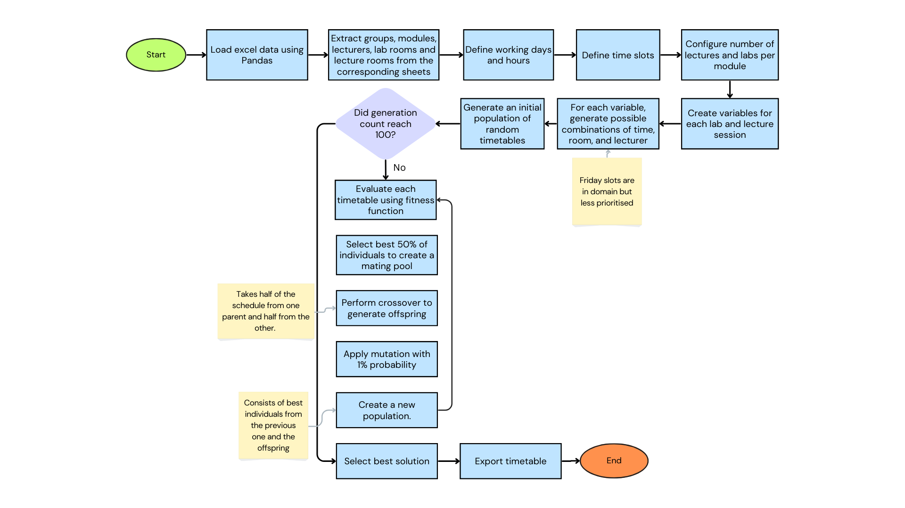

# Timetable creation using Genetic Algorithm
Timetabling system based on the genetic algorithm that takes the Excel file containing data about groups, modules, and rooms as input and creates a new excel file with the timetable for each group. 

## Documentation
See the GA.pdf for more information about this program and algorithm used.
## Using the code

### Prepare Excel file
Create an Excel file with 3 sheets - groups, modules, and rooms.
>See the timetable_data.xlsx for example, you can download and modify it to understand the structure.
1. Groups sheet should contain 1 column, where the first element is “GroupName” heading, under this cell provide the name of each group one by one. 
2. Modules sheet should contain 4 columns: Group, Module, ModuleName, Lecturers. First row contains corresponding headings that should be provided the same as mentioned here. All other rows contain the name of the group (preferably contains at least one alphabetic character), module code, module name and lecturers. Lecturers for the module should be separated by comma and be in one cell.
3. Rooms sheet should contain 2 columns: LectureRooms, LabRooms with corresponding headings. All rows under the heading row should contain names of the lecture rooms and lab rooms.

### Install requirements
```shell
pip3 install -r requirements.txt
```
### Organise folder
Put the Excel file in the folder where this program is located.
### Run program
```shell
python3 timetable.py
```
The program will ask you to provide the name of the file, you should enter it with extension.

If the filename is not valid you will be asked to provide it again and again until it is valid. 
If you don’t wish to proceed, press Ctrl+C.
### View the output
The generated file is located in the same directory as the program file. 
>Note that if you run the program again without changing the name of the output file, it will be overwritten.

